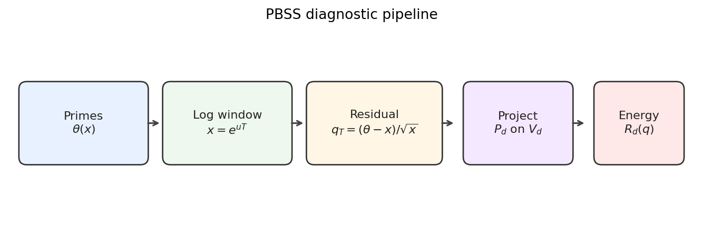
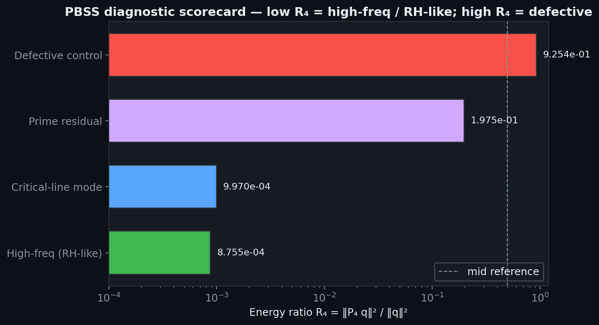
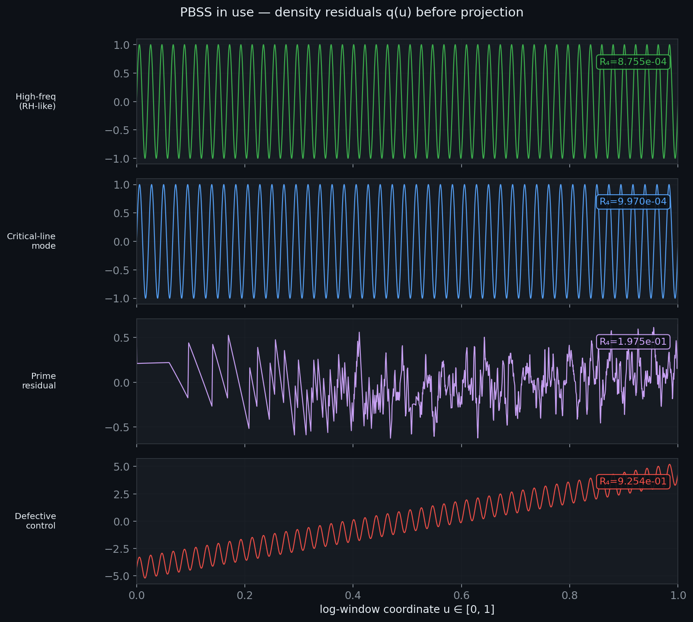
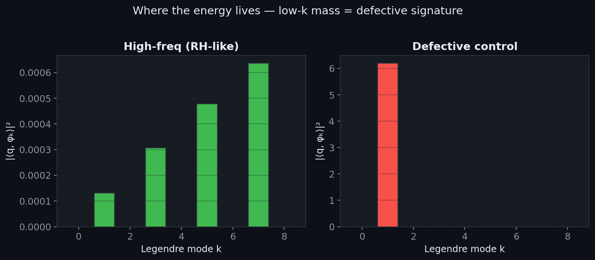
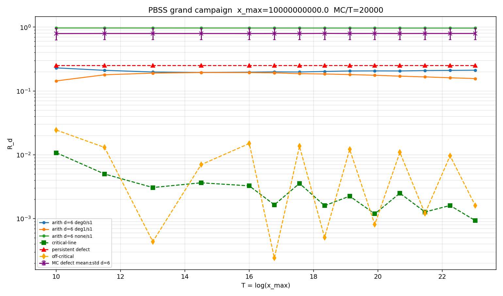
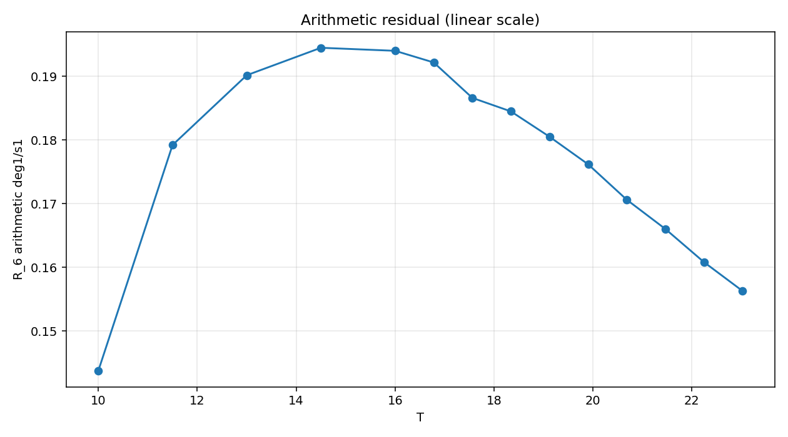
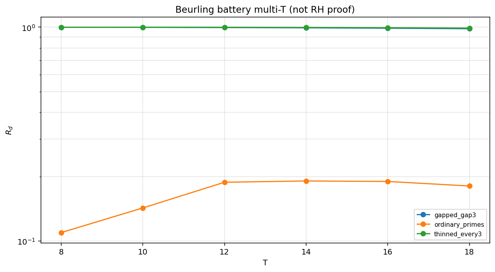
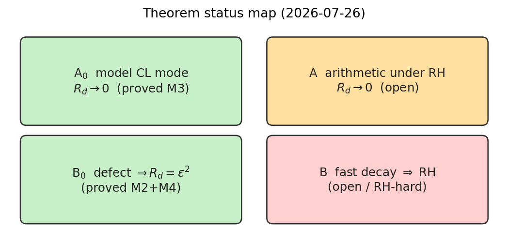

# Perry–Beurling Spectral Sieve

**PBSS** in this repository means **Perry–Beurling Spectral Sieve** — a projection
diagnostic for density residuals on logarithmic windows (not the pharmaceutical
society, IEEE WLAN “personal basic service set,” actuarial IAA section, or other
public expansions of the same acronym).

Open research archive and **runnable reconstruction** of the **Perry–Beurling Spectral Sieve** (spectral diagnostic / P(q) framework) for testing consistency with the Riemann Hypothesis on Beurling generalized prime systems.

**Author:** Nicholas Perry  
**Status:** Independent research. Reconstruction of core projection diagnostic (2026-07).  
**License:** MIT — see [`LICENSE`](LICENSE).  
**Not a proof of RH** — see [`docs/STATUS.md`](docs/STATUS.md).  
**Docs index:** [`docs/README.md`](docs/README.md).

## Overview

A spectral approach combining Beurling’s theory of generalized primes / Beurling zeta functions with a projection-based diagnostic. Analyze density perturbations \(q\) associated with prime systems and test whether their low-degree polynomial energy is consistent with all non-trivial zeros on \(\mathrm{Re}(s)=1/2\).

The framework is a **classifier / diagnostic**, not a full proof of RH.

## At a glance

<p align="center">
  
</p>

<p align="center"><em>Pipeline — density residual on a log-window, projected onto low-degree shifted Legendre modes.</em></p>

<p align="center">
  
</p>

<p align="center"><em>Diagnostic scorecard — low <code>R<sub>d</sub></code> for high-frequency / critical-line-like probes; high <code>R<sub>d</sub></code> for defective controls.</em></p>

| Residual waveforms | Mode energy spectrum |
|:------------------:|:--------------------:|
|  |  |

| Grand campaign \(R_d\) vs \(T\) | Arithmetic soft plateau |
|:------------------------------:|:-----------------------:|
|  |  |

| Beurling battery | Status map |
|:----------------:|:----------:|
|  |  |

More figures: [`docs/figures/`](docs/figures/) (canonical; paper uses the same files).

## Quick start

```bash
pip install -r requirements.txt
PYTHONPATH=src python3 -m pytest tests/ -v
PYTHONPATH=src python3 experiments/run_diagnostic.py
PYTHONPATH=src python3 experiments/run_multi_T.py --workers 86
PYTHONPATH=src python3 experiments/run_arithmetic_multi_T.py --workers 86
PYTHONPATH=src python3 experiments/run_overnight_campaign.py --workers 86 --scratch /tmp/pbss_campaign
PYTHONPATH=src python3 experiments/run_explicit_formula_peel.py
```

**Grand campaign** (shipped): `experiments/run_grand_campaign.py` — arithmetic residual to
\(x_{\max}=10^{10}\) (checkpointed primes), multi-\((d,\mathrm{detrend},\mathrm{smooth})\),
**≥2000 MC defect trials/T** (default 20k), CL/off-critical/defect controls, resume,
plots in `results/grand_campaign/`. Focus deg1: \(R_4\sim0.15\)–\(0.19\) through \(10^{10}\).
See `docs/STATUS.md`.

## Core math (shipped)

### Projection strength

1. Normalize a density perturbation \(q\) on the unit log-window \(u\in[0,1]\).
2. Project onto orthonormal **shifted Legendre** polynomials
   \(\varphi_k(u)=\sqrt{2k+1}\,L_k(2u-1)\).
3. Energy ratio
   \[
   R_d(q)=\frac{\|P_d q\|_{L^2}^2}{\|q\|_{L^2}^2}
   =\frac{\sum_{k=0}^d|\langle q,\varphi_k\rangle|^2}{\|q\|^2}.
   \]
4. Working projection strength (scaled)
   \[
   P(q)\;:=\;S_d(q)=T^{2(d+1)}\,R_d(q),
   \]
   with \(T\) the logarithmic window length (so \(S_d\) is \(O(1)\) under the
   RH decay heuristic \(R_d=O(T^{-2(d+1)})\)).

- **Low** \(R_d\) / controlled \(S_d\): high-frequency content — RH-like signature.  
- **High** \(R_d\): low-degree mass — defective / non-RH-like control.

### Legacy numbers

Earlier notes quoted **P(q)≈3.92** for zeta and threshold **≈29.5**. Those
used lost high-precision scripts. This reconstruction **does not hard-code
those values**; it reports \(R_d\) and \(S_d\) from the shipped path. See
`docs/STATUS.md`.

### Theorems A/B (precise status)

| Result | Status |
|--------|--------|
| **A₀** critical-line mode \(R_d\to0\) at \(O(T^{-2})\) | **Proved** (Lemma M3) |
| **Finite-mode A₀** finite CL sum \(R_d=O(T^{-2})\) | **Proved** (Lemma M5) |
| **Weighted model A₀** \(R_d(w q)=O(T^{-2})\) for \(w\in W_\alpha\) | **Proved** (Lemma M6) |
| **M7** \(R_d\) perturbation majorant | **Proved** |
| **A** arithmetic residual under RH | **Closed conditionally** (RH + cited ANT-1…3 + M5–M7) |
| **B₀** persistent defect \(\Rightarrow R_d=\varepsilon^2\not\to0\) | **Proved** (Lemmas M2–M4) |
| **B** fast residual decay \(\Rightarrow\) RH | **Package complete** — sole open step **B-RES** |
| **RH** unconditional | **Open** |

Explicit-formula residual: `pbss.probes.explicit_formula_residual` · peel scan:
`experiments/run_explicit_formula_peel.py` → `results/explicit_formula_peel/`.

Open-plateau: [`docs/RESEARCH_PLATEAU.md`](docs/RESEARCH_PLATEAU.md) · Theorem-A scaffold:
[`docs/THEOREM_A_SCAFFOLD.md`](docs/THEOREM_A_SCAFFOLD.md) · Tail remainder note:
[`docs/INFINITE_TAIL_REMAINDER.md`](docs/INFINITE_TAIL_REMAINDER.md).

Details: [`docs/THEOREMS_AB.md`](docs/THEOREMS_AB.md) · Proofs: [`docs/PROOFS_LEMMAS.md`](docs/PROOFS_LEMMAS.md) · Status: [`docs/STATUS.md`](docs/STATUS.md) · Paper: [`docs/paper/`](docs/paper/).

**Not an unconditional RH proof.**

## Repository layout

```
src/pbss/           # installable library
tests/              # pytest (real shipped paths)
experiments/        # campaign entry scripts
results/            # campaign JSON/TXT/plots (large primes gitignored)
docs/               # index: docs/README.md
docs/figures/       # canonical images (README + paper)
docs/paper/         # status note TeX/PDF only
docs/goals/         # optional agent goal files
docs/related/       # third-party reference PDFs
```

## Limitations

- Diagnostic, not a decisive RH proof.  
- Finite windows cannot exclude extremely high zeros.  
- Not a practical local primality sieve.  
- Large \(d\) or \(T\) is expensive.  
- Converse (low energy ⇒ RH) is essentially as hard as RH.

## Related work

### External (zeta / RH — reference only)

- **Anthropic (Aug 2026):** improved lower bound on the fraction of \(\zeta\) zeros on the critical line (~41.6% → ~67.2%).  
  Blog: [anthropic.com/research/riemann-zeta](https://www.anthropic.com/research/riemann-zeta) ·  
  Local PDFs + notes: [`docs/related/anthropic-riemann-zeta/`](docs/related/anthropic-riemann-zeta/)  
  (Third-party; not part of PBSS; different theorem class — see that README.)

### Jensen / de Bruijn–Newman (same author, pre-PBSS survivor)

- **Jensen/moment hierarchy blindness for \(\Lambda\):** central certificates falsely look hyperbolic down to \(t=-0.7\) while the binding Lehmer pair needs moment order \(\sim 13400\).  
  Note: [`docs/JENSEN_MOMENT_HIERARCHY_BLINDNESS.md`](docs/JENSEN_MOMENT_HIERARCHY_BLINDNESS.md) · code: `pbss.jensen_blindness`  
  (Not RH; not a new sharp \(\Lambda\) bound beyond optional bookkeeping.)

### Post-Jensen roadmap ranks 2–5 (executed)

| Rank | Deliverable |
|-----:|-------------|
| 2 | Plateau / secondary EF: [`docs/ARITHMETIC_PLATEAU_SECONDARY.md`](docs/ARITHMETIC_PLATEAU_SECONDARY.md) · `plateau_secondary_report` |
| 3 | ANT interface audit (freeze Full A): [`docs/ANT_INTERFACE_AUDIT.md`](docs/ANT_INTERFACE_AUDIT.md) · `ant_interface_audit` |
| 4 | Zero-proportion feasibility **STOP**: [`docs/ZERO_PROPORTION_FEASIBILITY.md`](docs/ZERO_PROPORTION_FEASIBILITY.md) |
| 5 | B-RES threshold \(H^*\): [`docs/B_RES_THRESHOLD.md`](docs/B_RES_THRESHOLD.md) · `b_res_threshold_report` |

### By the same author

- Other number-theory / exploratory archives (e.g. `perry-spirals`, `wieferich-hunts`) may appear under the same GitHub account; they are separate projects and not required to run PBSS.

---

*Independent research. MIT licensed. Not a proof of the Riemann Hypothesis.*
